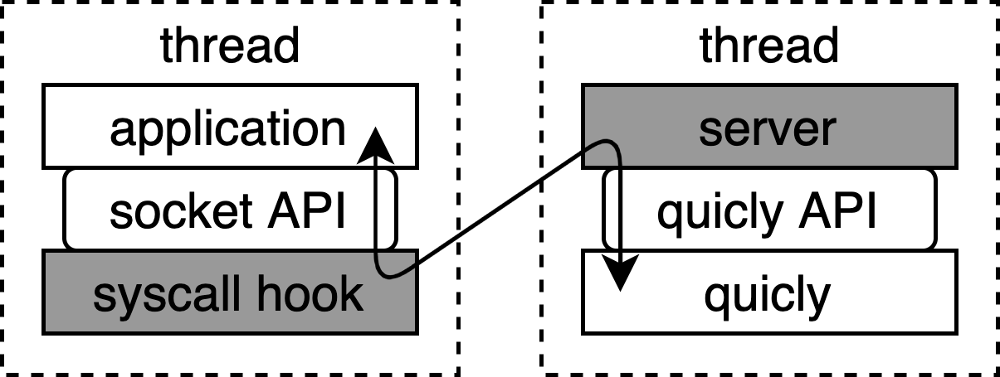

# poem-quicly

The meaning of poem is **po**rtable **em**ulation; poem-quicly offers a portable emulation layer that absorbs differences between the socket and quicly APIs.

## Motivation

QUIC is a transport protocol involving a number of enhancements over TCP.
QUIC has been typically implemented in user-space atop the kernel-space UDP implementation.
This choice speeds up development cycles, and allows each development community to maintain its own QUIC implementation.
As a result, there are various QUIC implementations made by different parties.

On the other hand, each QUIC implementation offers its specific API, that is different from the socket API typically used in UNIX(-like) OSes.
To integrate QUIC into an application program, users/developers have to edit the source code of it to apply the API that is specific to a particular QUIC implementation.
In many cases, source code modification is not a trivial task.
Moreover, since the API of a particular QUIC implementation is not compatible with others, the adaptation work is necessary for every QUIC implementation that the users/developers wish to use.

The motivation of poem-quicly is to reduce the adaptation cost of QUIC by enabling users to use QUIC over TCP sockets, without modifying the source code and binaries of existing applications.

## Overview

The figure below shows the overview of poem-quicly. Particularly, the shaded parts are implemented by poem-quicly.



Like microkernel services, poem-quicly launches a dedicated thread for executing quicly services (here, we call it the quicly server).
poem-quicly hooks system calls executed by the application thread, and they are redirected to the quicly server.

poem-quicly leverages UNIX domain sockets as the communication channel between the application thread and the quicly server thread. The use of UNIX domain sockets simplifies the implementation; particularly, they are compatible with kernel-space event mechanisms, including read, accept, select, poll, and epoll system calls, that block the thread until new data arrives, thus, our implementation does not need to take care about them.

## Arguments

The arguments can be passed to the poem-quicly subsystems through two environment variables ```QUICLY_HOOK_ARGS``` and ```QUICLY_SERVER_ARGS```; ```QUICLY_HOOK_ARGS``` is passed to the hook subsystem, and ```QUICLY_SERVER_ARGS``` is taken by the server subsystem.

```QUICLY_HOOK_ARGS``` is used for specifying two things: 1) the socket system call arguments (domain, type, and protocol) for creating QUIC sockets, and 2) a UNIX socket path used for communicating with the quicly server thread.

Typically, in Linux, a TCP socket is made by the system call ```socket(AF_NET, SOCK_STREAM, IPPROTO_IP (0) or IPPROTO_TCP (6))```.
When you wish to simply replace TCP socket creation with QUIC socket creation, please specify AF_INET for domain, SOCK_STREAM for type, and IPPROTO_IP (0) and IPPROTO_TCP (6) for protocol, in ```QUICLY_HOOK_ARGS```.

To use both TCP and QUIC in the same application, you can also define an identical way to create a QUIC socket, for example, ```socket(AF_NET, SOCK_STREAM, IPPROTO_QUIC /* any name is fine */)``` where you arbitrary choose a number for IPPROTO_QUIC.
(Note: in this case, you need to edit the application program to embed the line ```socket(AF_NET, SOCK_STREAM, IPPROTO_QUIC)``` so that you can differentiate the socket creation for TCP and QUIC.)
In this case, please specify the number, you selected for IPPROTO_QUIC, for the protocoal argument in ```QUICLY_HOOK_ARGS```.

```QUICLY_SERVER_ARGS``` takes three arguments: paths to 1) a cert file and 2) a key file used by quicly, and 3) a UNIX socket path used for communicating with the application threads.

- If ```QUICLY_HOOK_ARGS``` is specified, the socket-relevant system calls are hooked. Otherwise, not hooked.
- If ```QUICLY_SERVER_ARGS``` is specified, the quicly server thread is launched. Otherwise, not launched.

## User-defined socket system call arguments

To enable the co-location of TCP and QUIC, as described above, poem-quicly allows users to specify the socket arguments, including domain, type, and protocol, for creating a QUIC socket.

The way of specification is explained through the the C program below. Pleae save this as ```simple-echo.c```.

```
#include <stdio.h>
#include <stdlib.h>
#include <unistd.h>
#include <string.h>
#include <assert.h>

#include <sys/socket.h>

#include <netinet/in.h>

int main(int argc, char *const *argv)
{
	int ch;
	int port = -1;
	int domain = -1, type = -1, protocol = -1;
	int sockfd;

	while ((ch = getopt(argc, argv, "q:p:")) != -1) {
		switch (ch) {
		case 'p':
			port = atoi(optarg);
			break;
		case 'q':
			{
				char *_arg;
				assert((_arg = strdup(optarg)) != NULL);
				{
					size_t i, j, cnt, l = strlen(_arg);
					for (i = 0, j = 0, cnt = 0; j < l && cnt < 2; j++) {
						if (_arg[j] == ',') {
							_arg[j] = '\0';
							switch (cnt) {
							case 0:
								domain = atoi(&_arg[i]);
								break;
							case 1:
								type = atoi(&_arg[i]);
								break;
							}
							i = j + 1;
							cnt++;
						}
					}
					protocol = atoi(&_arg[i]);
				}
				free(_arg);
			}
			break;
		default:
			assert(0);
			break;
		}
	}

	assert(port >= 0 && domain >= 0 && type >= 0 && protocol >= 0);

	assert((sockfd = socket(domain, type, protocol)) != -1);
	{
		int on = 1;
		assert(!setsockopt(sockfd, SOL_SOCKET, SO_REUSEADDR, &on, sizeof(on)));
	}
	{
		struct sockaddr_in sin = {
			.sin_family = AF_INET,
			.sin_addr.s_addr = htonl(INADDR_ANY),
			.sin_port = htons(port),
		};
		assert(!bind(sockfd, (struct sockaddr *) &sin, sizeof(sin)));
	}
	assert(!listen(sockfd, SOMAXCONN));

	while (1) {
		int fd;
		struct sockaddr_in sin;
		socklen_t addrlen;
waitconn:
		addrlen = sizeof(sin);
		assert((fd = accept(sockfd, (struct sockaddr *) &sin, &addrlen)) != -1);
		while (1) {
			char buf[256];
			ssize_t l = read(fd, buf, sizeof(buf));
			if (l <= 0) {
closeconn:
				close(fd);
				goto waitconn;
			} else {
				ssize_t _l = 0;
				while (_l < l) {
					ssize_t tx = write(fd, &buf[_l], l - _l);
					if (tx < 0)
						goto closeconn;
					_l += tx;
				}
			}
		}
	}

	return 0;
}
```

Then, please compile it by the following command.

```
gcc simple-echo.c -o $MY_WORKDIR/simple-echo
```

Essentially, this C program is a simple echo server. The primary point is  ```socket(domain, type, protocol)```; this allows us to choose an arbitrary set of arguments for the socket system call.

The arguments of this simple echo server program are:

- ```-p```: port number on which the simple echo server listens
- ```-q```: ```domain,type,protocol``` (no space between them) that are the arguments passed to the socket system call

For example, the following will do ```socket(2 /* AF_INET */, 1 /* SOCK_STREAM */, 6 /* IPPROTO_TCP */)```, then, work as the simple TCP echo server listening on port 10000.

```
$MY_WORKDIR/simple-echo -p 10000 -q 2,1,6
```

To confirm the behavior, please open another console and type the following command. It will connect to the simple echo server above through TCP.

```
telnet localhost 10000
```

Now, let's say you define IPPROTO_QUIC as 123456, and wish to create a QUIC socket when ```socket(AF_INET, SOCK_STREAM, 123456 /* IPPROTO_QUIC */)``` is triggered. The following command will do that.

```
$MY_WORKDIR/simple-echo -p 10000 -q 2,1,123456
```

By default, the command above fails because the kernel does not implement the user-defined IPPROTO_QUIC.

OK, let's use poem-quicly.

Please save the following as ```launch-app-with-quicly-hook-proto123456.sh```

```
#!/bin/bash

if [ "${MY_WORKDIR}x" = "x" ]; then
	echo "please export the work directory for \$MY_WORKDIR"
	exit 0
fi

if [ "${1}x" = "x" ] || [ "${2}x" != "--x" ]; then
	echo "usage: $0 [unix socket path] -- [command]"
	exit 0
fi

QUICLY_HOOK_ARGS="-q 2,1,123456 -u $1" \
LIBZPHOOK=$MY_WORKDIR/poem-quicly/libpoem-quicly.so \
LD_PRELOAD=$MY_WORKDIR/zpoline/libzpoline.so \
${@:3:($#-1)}
```

The point in the script above is ```QUICLY_HOOK_ARGS="-q 2,1,123456 -u $1" \```; this tells poem-quicly to create QUIC sockets when AF_INET, SOCK_STREAM, and 123456 are passed to the socket system call.

The following command launches the simple echo server opening a QUIC socket for the user-defined IPPROTO_QUIC (123456). ( Please do this after starting the quicly server using the ```launch-quicly-server.sh``` shown in [../README.md](../README.md). )

```
bash launch-app-with-quicly-hook-proto123456.sh /tmp/quicly-server.sock -- $MY_WORKDIR/simple-echo -p 10000 -q 2,1,123456
```

Please open another console, and try telnet using the ```launch-app-with-quicly-hook.sh``` script shown in [../README.md](../README.md).

```
bash launch-app-with-quicly-hook.sh /tmp/quicly-server.sock -- telnet localhost 10000
```

Supposedly, telnet connects to the QUIC socket opened by ```socket(AF_INET, SOCK_STREAM, 123456 /* IPPROTO_QUIC */)``` in the simple echo server.
