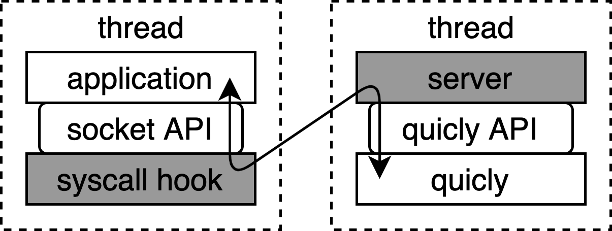

# poem-quicly: using QUIC over the socket API

poem-quicly allows users to **transparently** use the QUIC transport protocol behind TCP sockets.

In other words, poem-quicly allows users to replace TCP with QUIC without modifying the source code and binaries of existing applications.

poem-quicly employs [quicly](https://github.com/h2o/quicly) as the QUIC implementation, and glues the socket API and the quicly API.

To achieve transparent replacement, poem-quicly leverages [zpoline](https://github.com/yasukata/zpoline), a lightweight system call hook mechanism, to hook the socket-relevant system calls and converts them into QUIC operations.

poem-quicly also allows users to use QUIC over a user-defined (non-TCP) socket, such as ```socket(AF_INET, SOCK_STREAM, IPPROTO_QUIC /* user-defined number */)```.
More information is found in [Documentation/README.md](Documentation/README.md).

## Note

This implementation is experimental, and some emulation may not work properly.

## Important notice

If you find this is slow, it is due to poem-quicly. Currently, performance is not the primary focus of poem-quicly.

**It means that QUIC is not slow and quicly is not slow.**

## Target platform

This implementation assumes Linux on x86-64 CPUs.

## Overview

poem-quicly offers a **po**rtable **em**ulation layer that absorbs differences between the socket and quicly APIs.
The figure below shows the overview of poem-quicly. Particularly, the shaded parts are implemented by poem-quicly.



Like microkernel services, poem-quicly launches a dedicated thread for executing the quicly services (here, we call it the quicly server).
poem-quicly hooks system calls executed by the application thread, and they are redirected to the quicly server.

To simplify the implementation, poem-quicly leverages UNIX domain sockets as the communication channel between the application thread and the quicly server thread.

## How to build

First, please select a directory where you wish to locate poem-quicly. In this example, we choose ```$HOME/quicly-over-socket``` and it is exported as ```MY_WORKDIR```.

```
export MY_WORKDIR="$HOME/quicly-over-socket"
```
```
mkdir $MY_WORKDIR
```

Then, please download poem-quicly and zpoline source code by git clone.

```
git clone https://github.com/yasukata/poem-quicly.git $MY_WORKDIR/poem-quicly
```
```
git clone https://github.com/yasukata/zpoline.git $MY_WORKDIR/zpoline
```

The following command recursively downloads quicly, [picotls](https://github.com/h2o/picotls), and other repositories associated with them.

```
git -C $MY_WORKDIR/poem-quicly submodule update --init --recursive
```

The following compiles quicly, picotls, and poem-quicly, then, a library file ```$MY_WORKDIR/poem-quicly/libpoem-quicly.so``` will be produced.

```
make -C $MY_WORKDIR/poem-quicly
```

The following command compiles zpoline and generates ```$MY_WORKDIR/zpoline/libzpoline.so```.

```
make -C $MY_WORKDIR/zpoline
```

## Setup

Before starting to run poem-quicly, please type the following command that is necessary for zpoline.

```
sudo sh -c "echo 0 > /proc/sys/vm/mmap_min_addr"
```

For details, please refer to [https://github.com/yasukata/zpoline](https://github.com/yasukata/zpoline).

## Quick Example

This example uses two scripts:

1. ```launch-quicly-server.sh``` launches a quicly server thread in a dedicated process.
2. ```launch-app-with-quicly-hook.sh``` launches an application process while applying the system call hooks.

### quicly server launcher script

Please save the following as ```launch-quicly-server.sh```.

```
#!/bin/bash

if [ "${MY_WORKDIR}x" = "x" ]; then
	echo "please export the work directory for \$MY_WORKDIR"
	exit 0
fi

if [ "${1}x" = "x" ]; then
	echo "usage: $0 [unix socket path]"
	exit 0
fi

QUICLY_SERVER_ARGS="-c $MY_WORKDIR/poem-quicly/quicly/t/assets/server.crt -k $MY_WORKDIR/poem-quicly/quicly/t/assets/server.key -u $1" \
LIBZPHOOK=$MY_WORKDIR/poem-quicly/libpoem-quicly.so \
LD_PRELOAD=$MY_WORKDIR/zpoline/libzpoline.so \
sleep infinity
```

### Application launcher script

Please save the following as ```launch-app-with-quicly-hook.sh```.

```
#!/bin/bash

if [ "${MY_WORKDIR}x" = "x" ]; then
	echo "please export the work directory for \$MY_WORKDIR"
	exit 0
fi

if [ "${1}x" = "x" ] || [ "${2}x" != "--x" ]; then
	echo "usage: $0 [unix socket path] -- [command]"
	exit 0
fi

QUICLY_HOOK_ARGS="-q 2,1,0 -q 2,1,6 -u $1" \
LIBZPHOOK=$MY_WORKDIR/poem-quicly/libpoem-quicly.so \
LD_PRELOAD=$MY_WORKDIR/zpoline/libzpoline.so \
${@:3:($#-1)}
```

### Testing with nc and telnet

Please open three consoles, and type the following each. ( Please respect the order from 1 to 3 )

1. launch the quicly server
```
bash launch-quicly-server.sh /tmp/quicly-server.sock
```
2. execute nc
```
bash launch-app-with-quicly-hook.sh /tmp/quicly-server.sock -- nc -l 10000
```
3. execute telnet
```
bash launch-app-with-quicly-hook.sh /tmp/quicly-server.sock -- telnet localhost 10000
```

What the commands above do are:

1. launches a quicly server process that waits for UNIX domain socket connection at ```/tmp/quicly-server.sock```.
2. executes nc command that listens on port 10000 while specifying ```/tmp/quicly-server.sock``` for the UNIX domain socket path to communicate with the quicly server.
3. executes telnet command that connects to port 10000 while specifying ```/tmp/quicly-server.sock``` for the UNIX domain socket path to communicate with the quicly server.

Supposedly, you will find nc and telnet are connected.
The communication between these two is done through QUIC.

You will see UDP (QUIC) packets rather than TCP if you run
```
sudo tcpdump -i lo
``` 
while nc and telnet are talking.

### Other examples

iperf3

2. launch an iperf3 server
```
bash launch-app-with-quicly-hook.sh /tmp/quicly-server.sock -- iperf3 -s4
```
3. execute an iperf3 client
```
bash launch-app-with-quicly-hook.sh /tmp/quicly-server.sock -- iperf3 -c localhost
```

curl

2. execute nc
```
echo "HTTP/1.1 200 OK\r\nContent-Length: 15\r\nConnection: keep-alive\r\n\r\nmessage from nc" | bash launch-app-with-quicly-hook.sh /tmp/quicly-server.sock -- nc -l 10000
```
3. execute curl
```
bash launch-app-with-quicly-hook.sh /tmp/quicly-server.sock -- curl localhost:10000
```

## Further information

The detailed information on poem-quicly, including the arguments specified through ```QUICLY_HOOK_ARGS``` and ```QUICLY_SERVER_ARGS```, is described in [Documentation/README.md](Documentation/README.md).
